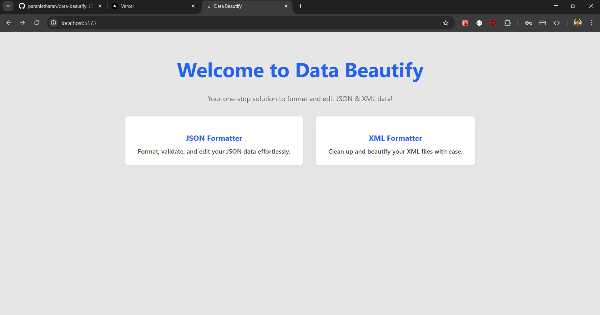
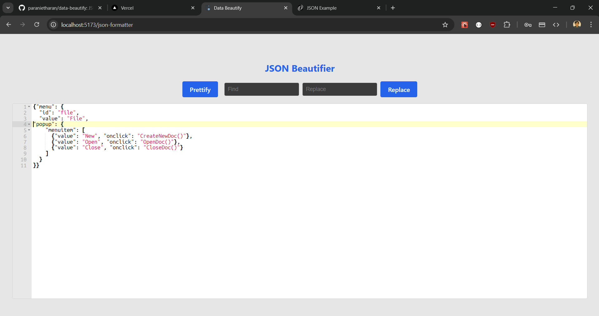
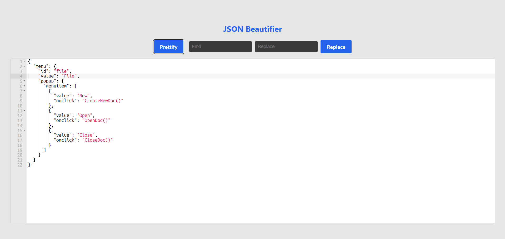
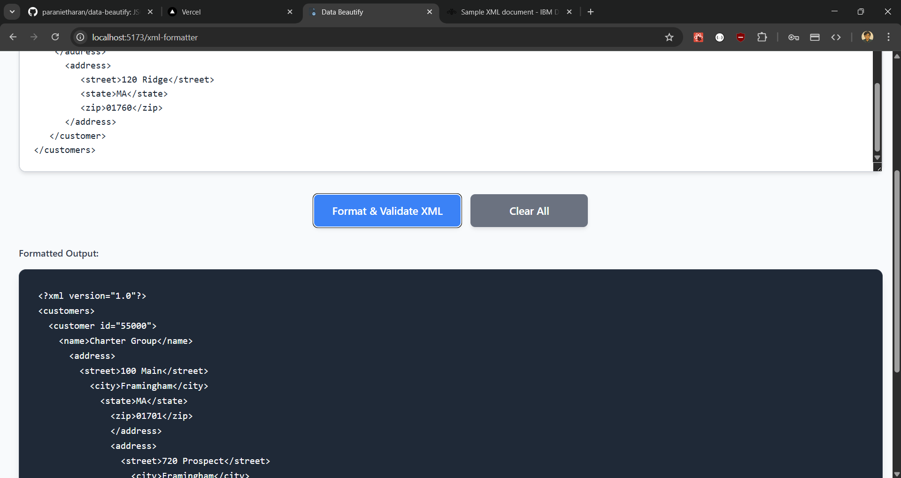

# 🧼 Data Beautify

Data Beautify is an elegant and developer-friendly web tool for formatting and editing JSON and XML files. It provides a clean frontend interface with advanced features like syntax error detection, validation, and find-and-replace functionality.

Built using **React + TypeScript**, styled with **CSS Modules**, and organized in a scalable folder structure.

## ✨ Features

- ✅ **JSON Formatter** - Beautify and validate JSON with syntax highlighting
- ✅ **XML Formatter** - Format and validate XML with proper indentation
- ✅ **Syntax Error Detection** - Real-time validation with detailed error messages
- ✅ **Find & Replace** - Advanced search and replace functionality for JSON
- ✅ **Responsive Design** - Clean, minimal UI that works on all devices
- ✅ **Real-time Validation** - Instant feedback on data structure issues
- ✅ **Modern UI/UX** - Professional interface with smooth animations

## 🖼️ Screenshots

### Homepage

*Clean and modern homepage with navigation to different formatters*

### JSON Formatter

*Input view showing unformatted JSON data*


*Output view showing beautifully formatted JSON with syntax highlighting*

### XML Formatter

*XML formatter with validation and error detection capabilities*

## 🚀 Getting Started

### Prerequisites

- Node.js (version 16 or higher)
- npm or yarn package manager

### Installation

1. **Clone the repository**
   ```bash
   git clone https://github.com/yourusername/data-beautify.git
   cd data-beautify
   ```

2. **Install dependencies**
   ```bash
   npm install
   ```

3. **Start the development server**
   ```bash
   npm run dev
   ```

4. **Open your browser**
   Navigate to `http://localhost:5173` to view the application

### Build for Production

```bash
npm run build
```

The built files will be in the `dist` directory.

## 🛠️ Available Scripts

- `npm run dev` - Start development server
- `npm run build` - Build for production
- `npm run preview` - Preview production build
- `npm run lint` - Run ESLint for code quality

## 🏗️ Project Structure

```
data-beautify/
├── src/
│   ├── Pages/
│   │   ├── HomePage.tsx              # Landing page
│   │   ├── JSONFormatterPage.tsx     # JSON formatter component
│   │   ├── XMLFormatterPage.tsx      # XML formatter component
│   │   └── NotFound.tsx              # 404 page
│   ├── App.tsx                       # Main app component
│   ├── main.tsx                      # Entry point
│   └── index.css                     # Global styles
├── public/                           # Static assets
├── screenshot/                       # Project screenshots
└── package.json                      # Dependencies and scripts
```

## 🎯 Usage

### JSON Formatter
1. Navigate to the JSON formatter page
2. Paste your JSON data in the input area
3. Click "Format JSON" to beautify your data
4. Use the find & replace feature to modify content
5. Copy the formatted output

### XML Formatter
1. Navigate to the XML formatter page
2. Paste your XML data in the input area
3. Click "Format & Validate XML" to process your data
4. View any validation errors or warnings
5. Copy the formatted output

## 🔧 Technical Details

### Built With
- **React 19** - Modern React with latest features
- **TypeScript** - Type-safe JavaScript
- **Vite** - Fast build tool and dev server
- **CSS Modules** - Scoped styling
- **React Router** - Client-side routing
- **Monaco Editor** - Code editor integration

### Key Features Implementation
- **Real-time Validation** - Uses DOMParser for XML and JSON.parse for JSON
- **Error Handling** - Comprehensive error detection with user-friendly messages
- **Responsive Design** - Mobile-first approach with viewport-based sizing
- **Performance** - Optimized with Vite and modern React patterns

## 🐛 Error Handling

The application provides detailed error messages for:
- **JSON**: Syntax errors, missing brackets, invalid characters
- **XML**: Malformed tags, unclosed elements, invalid structure
- **Validation**: Real-time feedback with specific line/column information

## 📱 Responsive Design

- **Mobile-first** approach
- **Viewport-based** sizing (100vw)
- **No horizontal scrolling** on any device
- **Touch-friendly** interface elements
- **Adaptive layouts** for different screen sizes

## 🤝 Contributing

1. Fork the repository
2. Create a feature branch (`git checkout -b feature/amazing-feature`)
3. Commit your changes (`git commit -m 'Add some amazing feature'`)
4. Push to the branch (`git push origin feature/amazing-feature`)
5. Open a Pull Request